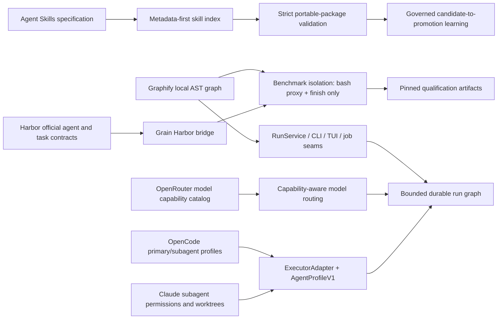

# Grain Research and Implementation Graph

Updated: 2026-07-21

This is the evidence map behind the 1.0 work. External nodes are primary
specifications or official product documentation; internal nodes are verified
Grain implementation boundaries. It is not benchmark evidence.



## Local graph evidence

Graphify was run locally in code-only mode with no model extraction:

```sh
graphify extract . --code-only --no-cluster --force --out /private/tmp/grain-graphify
```

The 2026-07-21 graph contained 1,586 nodes and 4,690 edges across 251 code
files. Traversal connected `GrainAgent` → terminal bridge → `agentLoop` → the
host-bound tool registry. That exposed a qualification flaw: Harbor proxied
`bash`, but native filesystem, memory, MCP, code-index, and delegation tools
could still be offered to the benchmark model. Bridge mode now excludes those
paths and describes `/app`/Linux rather than the host checkout in its prompt.

## Primary sources

- [Harbor task structure](https://www.harborframework.com/docs/tasks)
- [Harbor custom agent contract](https://www.harborframework.com/docs/agents)
- [Official Terminal-Bench workflow](https://www.harborframework.com/docs/tutorials/running-terminal-bench)
- [Agent Skills specification](https://agentskills.io/specification)
- [Claude Code subagents](https://code.claude.com/docs/en/sub-agents)
- [Claude Code worktrees](https://code.claude.com/docs/en/worktrees)
- [OpenCode agents](https://opencode.ai/docs/agents)
- [OpenRouter model metadata](https://openrouter.ai/docs/guides/overview/models)
- [OpenRouter tool calling](https://openrouter.ai/docs/guides/features/tool-calling)
- [Graphify quickstart](https://graphify.com/docs)

## Next graph cuts

1. Move the remaining lifecycle choices in `agentLoop` behind `RunService`.
2. Add a real Harbor canary task that proves the agent cannot observe a host
   canary file while it can mutate and verify `/app`.
3. Graph the writable Engram repository and reconcile its duplicate routers
   before implementing `/v1`.
4. Compare context tokens and task success with and without graph retrieval;
   do not assume graph traversal is better than lexical/vector retrieval for
   every query class.
